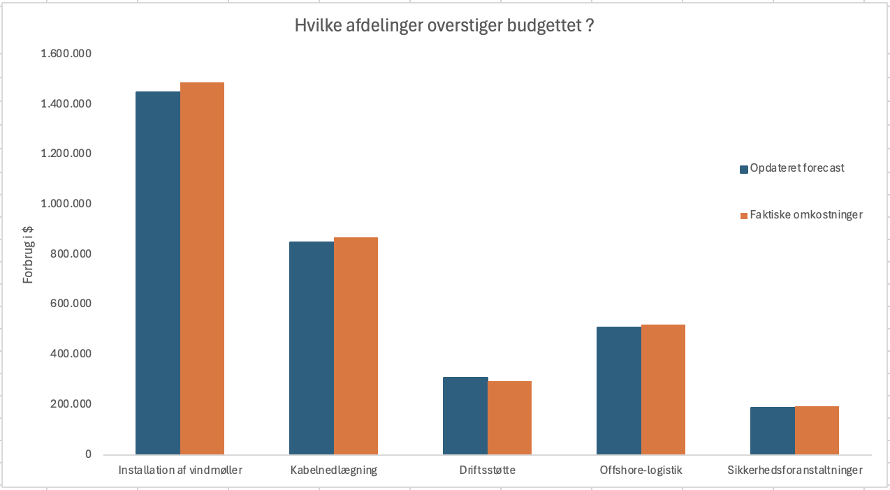

#  Budget og omkostningsstyring

##Billede skal være her 

## Litteraturliste

- [Formål](#Formål)
- [User story](#User-story)
- [Objektivitet](#Objektivitet)
- [Bruger detalje](#Bruger-detalje)
  - [Hvad har de svært med](#Hvad-har-de-svært-med) 
  - [Hvad ser succes ud for dem](#Hvad-ser-succes-ud-for-dem)
  - [Hvad skal der bygges](#Hvad-skal-der-bygges)
- [Analyse](#Analyse)
  - [Fund](#Fund)
- [Visualisering](#Visualisering)
- [Handlingsplan](#Handlingsplan)
- [Scenarieanalyse](#Scenarieanalyse)
- [Anbefalinger](#Anbefalinger)
- [Konklusion](#Konklusion) 

# Formål 
udarbejd projektbudgetter i Excel baseret på en rullende forecast.
User Story
Vestas er under en større omstrukturering af deres interne organisationsstruktur, og har derfor hyret dig, som en ekstern konsulent. Din opgave er at opstille en budgetprognose, med funktioner som løbende kan opdatere afvigelser og prognoser. Derefter har du til opgave at udarbejde en scenarieanalyse indeholdende best case, worst case og "Mest sandsynlige tilfælde” og simuler, hvordan ændringer i antagelser påvirker budgettet.

# Objektivet
At skabe en udgiftsrapport for Vestas
•	Spotte afdelinger som over forbruger 
•	Følge hver afdelings økonomiske bevægelser
•	Lave smartere budget valg

# Bruger detalje
Hvem er brugeren 
•	Vestas’ CFO
Hvad har de svært med 
•	De er under en uforudsigelig periode med omstruktureringen 
•	De vil have et overblik over forbruget

### Hvordan ser succes ud for dem?
De vil have: 
•	En tabel som viser deres afdelinger og deres forbrug
•	En måde at kunne markere overforbrug automatisk
•	En visuel som kan hjælpe med at vise hvad pengene går til 
•	En scenarieanalyse

### Hvad skal der bygges?
Tabellen skal inkludere:
•	Projektområde
•	Oprindeligt budget
•	Opdateret forecast 
•	Faktiske omkostninger
•	Mærkatet som viser når budgetter er overskredet

# Analyse

### Fund
Vestas har med deres omstrukturering varetaget en opdateret forecast af forbruget som, deres forskellige afdelingerne har til rådighed. Budgettet illustreres i følgende tabel:

(

Med allokeringen af pengene til andre afdelinger, som havde et større behov. Sikre Vestas at belastningen under omstruktureringen ikke var mere alvorlig. Udregningen af afvigelserne af budgettet ser ud som følgende:

Afvigelserne i tabellen viser forskellen mellem den opdatererede prognose, som Vestas’ finansielle afdeling varetog, og de faktiske omkostninger afdelingerne ren faktisk havde. Underafdelingerne har ifølge afvigelsen ikke holdt sig inden for budgettet. Udover Driftsstøtte, som har sparet virksomheden for 15.000 $. 

# Visualisering
Diagrammet forneden illustreret forbruget, som afdelingerne skulle have holdt sig inde for og det som aktuelt står til. De blå søjler repræsenterer de målte omkostninger i Dollars, hvor de orange repræsenterer de faktiske omkostninger i Dollars:

(

Betinget formatering er blevet anvendt for at tydeligere hvilke afdelinger, som holdte sig inden for budgettet, de som ikke gjorde:

(

Med følgende HVIS funktion blev kategoriseringen automatiseret:

# Scenarieanalyse 
Kvartalsbudgettet som finansafdelingen for Vestas’ fik udregnet indholdene de opdaterede forecast og faktiske omkostninger, er den mest sandsynlige scenarie som kunne hænde. Det afspejler de forventninger som virksomheden rent faktisk havde for de forskellige afdelingers. Nedenfor er der blevet udarbejdet en best case, og wost case scenarie for budgettet, som antager at alle projekter holder sig under budgettet 7%, og 10% over.

 

 

# Handlingsplan

##### Strammere overvågning:

Vestas har deres omstrukturering stået i en uforudsigelig situation, hvor mangle bolde skulle jongleres med oppe i luften. Virksomheden kan i stedet for føre budgetopfølgning kvartalsvist, især under en omstrukturering, overvåge budgettet månedligt. Dette kan hjælpe med at allokere budgettet hurtigere.
 
##### Sikkerhedsnet:

Som vist i budgettet, er afvigelserne ikke ude i det ekstreme. Det højeste man finder under installationen af vindmøller som står til at have brugt mere end 40.000 $. Der bør derfor opstilles en sikkerhedsnet f.eks. 10% af det totale budget for at undgå lignende situationer.

##### Scenarieanalyse:

Scenarieanalyser bør implementeres i planlægningsprocessen, og gjort til et fast værktøj. Sammen med et videreudviklet dashboard, som skaber et overblik for ledelsen, så de kan tage datadrevne valg.
